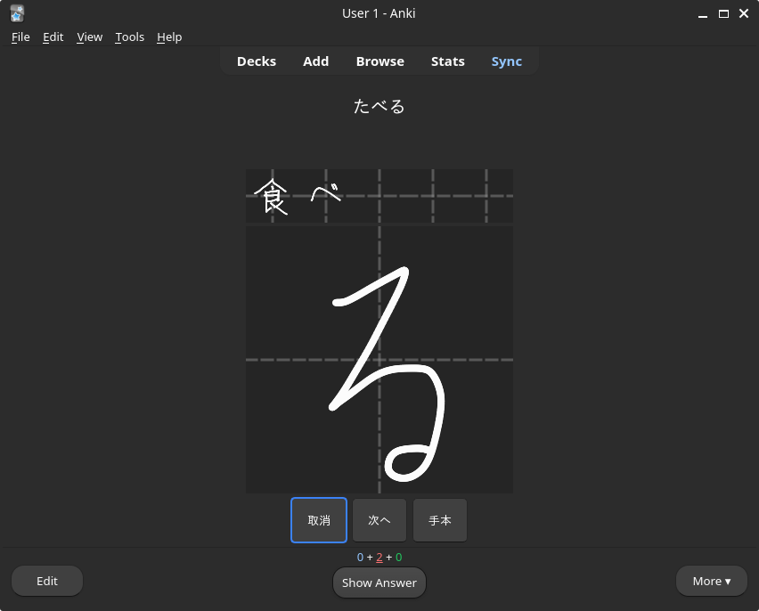
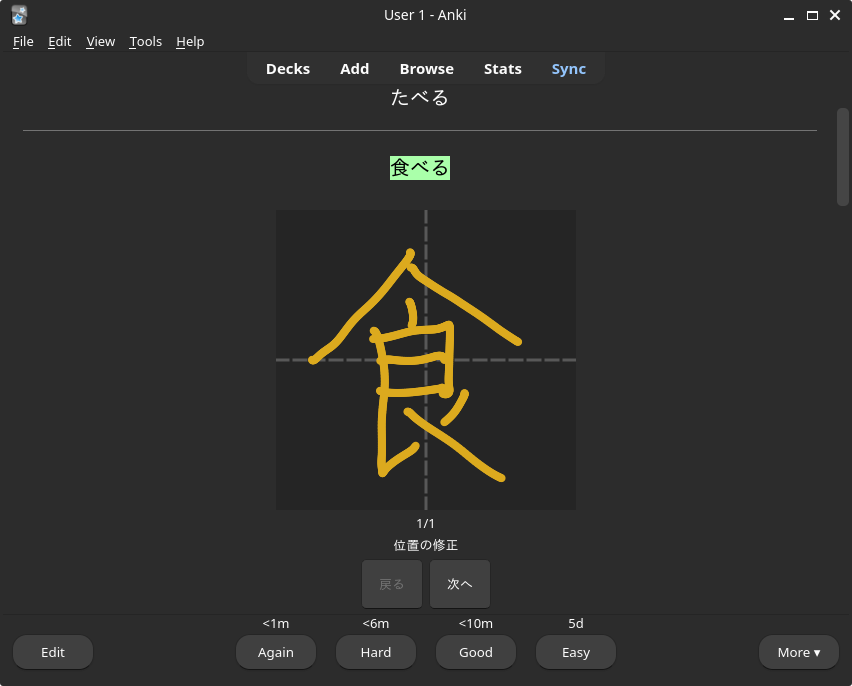

# Japanese Handwriting Input for Anki

An Anki addon for writing Japanese characters by hand. Draw kana or kanji on a canvas inside Anki and the addon recognizes what you wrote and inserts it into the active field.

## Features

- **Hiragana recognition.** Draw a hiragana on the canvas, get the matching character. 
- **Kanji handwriting feedback** *(experimental)*. Draw a target kanji and get back what was wrong: missing strokes, extra strokes, wrong order, position issues, and per-stroke shape quality.

 

## Install the Add-on

1. Open Anki
2. Go to Tools → Add-ons
3. Click Get Add-ons...
4. Enter this Add-on ID: 1324989483
5. Restart Anki after installation.

## License

The KanjiVG-derived data in `data/` is licensed under
[CC BY-SA 3.0](https://creativecommons.org/licenses/by-sa/3.0/). See `data/LICENSE.txt` for full attribution.
