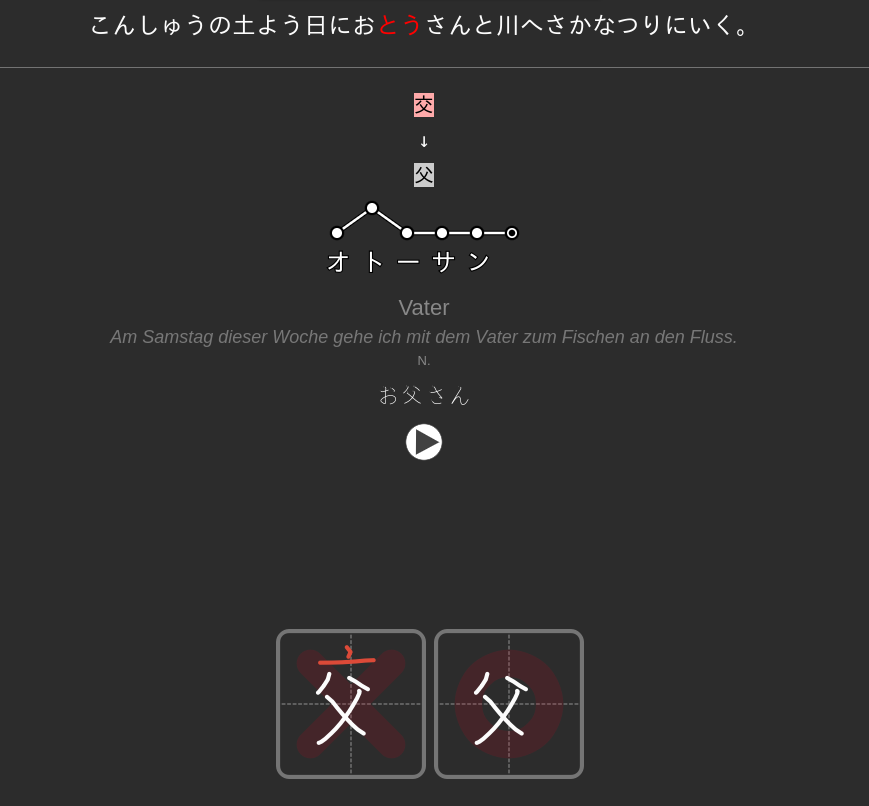

# Japanese Handwriting Input for Anki

An Anki add-on for practicing Japanese handwriting. Draw a hiragana, katakana, or kanji on a canvas inside Anki, and the add-on recognizes what you wrote and inserts it into the active field. For kanji practice, it can also check your drawing against a target character and show you both what went wrong and how it should look.

⚠️ **Early development:** Handwriting recognition and writing correction may not yet be accurate enough for reliable use.

## Features

- Handwriting recognition 
  - draw a hiragana, katakana, or kanji on the canvas and get the matching character inserted into the active field.

- Kanji handwriting feedback
  - draw a kanji you're studying and see your handwriting checked against the reference, with mistakes marked on your strokes and a corrected version shown alongside.

 

## Install the Add-on

1. Open Anki
2. Go to Tools → Add-ons
3. Click Get Add-ons...
4. Enter this Add-on ID: 1324989483
5. Restart Anki after installation.

## Recognition

The add-on currently uses a recognition engine based on HMM. 

This benchmark tracks the recognition engines and models the add-on uses, or has considered using over time. The table compares the percentage of correctly recognized characters across samples from 6 writers of the *HANDS-nakayosi_t-98-09* dataset for the DTW engine, Zinnia (using a model from Tegaki) and a custom HMM recognizer.  The selected writers are evenly split in men and women.

|                         | Hiragana | Katakana | Kanji  | Japanese |
| ----------------------- | -------- | -------- | ------ | -------- |
| correct (HMM)           | 92.85%   | 81.61%   | 96.55% | 93.71%   |
| correct (DTW)           | 59.5%    | 62.67%   | 54.23% | 53.15%   |
| correct (Zinnia+Tegaki) | 21.53%   | 2.01%    | 47.77% | 45.13%   |

### Stroke Correspondence

The stroke correspondence algorithm has limited support for:

- wrong stroke order
- missing strokes
- added strokes
- merged strokes

The table compares the percentage of character samples with correctly matched strokes from 6 writers from the *HANDS-nakayosi_t-98-09* dataset for each 漢検 level.

| Level   | １０級 | ９級  |
| ------- | ------ | ----- |
| Tested  | 80/80  | 0/160 |
| Correct | 89.53% | -     |

## License & Acknowledgment

The KanjiVG-derived data in `data/` is licensed under
[CC BY-SA 3.0](https://creativecommons.org/licenses/by-sa/3.0/). See `data/LICENSE.txt` for full attribution.

This project uses TUAT Nakagawa Lab. HANDS-nakayosi_t-98-09 stroke database.